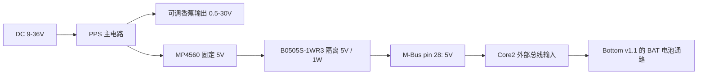

# Core2 + PPS + Base Bottom v1.1

基于 [M5Stack 官方 PPS UserDemo](https://github.com/m5stack/M5Module-PPS-UserDemo)
的 Core2 项目，保留官方 LVGL 触屏界面，增加串口诊断和空载输出测试。

## 来源与修改

复制官方提交 `6a3e83d0db9d7ed832627930c79ec45153b39f6c` 的 `src/`、
`include/`、`lib/M5Module-PPS/` 及 MIT LICENSE，保留生成代码原有版权声明。
构建固定使用 espressif32 6.13.0、M5Unified 0.2.21、M5GFX 0.2.28、LVGL 8.3.10。

本地修改：

- Core2 / 16MB Flash 构建配置，串口烧录速度为 115200。
- Core2 M-Bus 设为外部电源输入，关闭总线升压输出；屏幕亮度为 96/255，
  关闭电池充电、IMU 和麦克风初始化，减少辅助电源负担。
- `STATUS / SCAN / SET / ON / OFF` 串口接口与触屏操作在同一 LVGL 任务中执行。
- 启动保持可调输出关闭。使能前检查模块 ID、9-36V 输入、有效 V/I 设定；
  本 demo 保留至少 1V 输入余量。`SET` 会先关闭输出，必须另发 `ON`。
- 串口修改后同步屏幕设定，进入设置页也从硬件读取现有设定。
- 驱动只接受完整 I2C 读数，并初始化运行模式读取缓冲区。

此项目烧录 Core2 的 ESP32，不更新 PPS 内部 STM32 固件，不修改校准数据。

## 编译、烧录、测试

在仓库根目录执行：

```sh
pio run -d core2/pps
pio run -d core2/pps -t upload --upload-port /dev/cu.usbserial-5B1F0084761
pio device monitor -b 115200 -p /dev/cu.usbserial-5B1F0084761
```

串口命令需换行，示例：

```text
STATUS
SCAN
SET 3.3 0.1
ON
OFF
```

`SET` 的第二个参数是电流上限（A），不是强制输出电流。`STATUS` 返回 JSON；
`v_set/i_set` 为设定回读，`vout/iout` 为 PPS 的实际输出回读，`mode=1` 是 CV，
`mode=2` 是 CC，`mode=0` 是关闭。`battery_ma` 为正表示充电、为负表示放电。
`vbus_mv` 是 PMIC 的 VBUS 读数，其对应电源路径取决于 Core2 硬件版本，
不能一律当作 USB 电压。

确认香蕉输出端没有连接设备，提供合规 DC 输入后执行：

```sh
/Users/leonardo.lu/.platformio/penv/bin/python core2/pps/tools/test_output.py \
  --port /dev/cu.usbserial-5B1F0084761 --empty-output --log tmp/pps/output-test.log
```

脚本测试 1、3.3、5、8、5、3.3、1V，限流 0.1A，读取每档三次输出，
容许回读偏差 80mV；最后请求并确认输出关闭。输入余量不足的档位会跳过。
这是内部回读的空载测试，不能替代万用表、负载调整率或 CC 限流验收。

官方界面：点击底部按钮进入设置页，A 切换所选数位，B 增加，C 减少，
长按 A 开关输出。屏幕上的对应触控区域执行相同操作。

## 能否减少到一根供电线

**PPS 有向 M-Bus 提供固定隔离 5V 的硬件通路。Core2 支持外部 M-Bus 输入；
这组设备有条件实现仅接 PPS DC 输入。额定辅助供电能力仅约 1W / 200mA，
冷启动和持续稳定性需要实机确认。**

从官方原理图推导的路径：



- PPS 主板的 `PS_VIN` 经 U3 / MP4560 产生 `SYS_5V`；隔离板 M1 将其变为
  `ISO_5V`；主板 `BUS1` pin 28 直接接 `ISO_5V`，pin 1/3/5 为 `ISO_GND`。
- B0505S-1WR3 是**非稳压** 1W 隔离 DC/DC，数据表给出 5V 输出、最大 200mA。
  PPS 宣称的 100W 可调输出额定功率不适用于主机这路辅助电源。
- Core2 官方 SDK 的 `kMBusModeInput` 用于外部 5V 供电。
  M5Unified 的 `config.output_power=false` / `M5.Power.setExtOutput(false)`
  关闭主机向总线升压供电，允许外部输入。
- Base Bottom v1.1 是 110mAh 电池及引脚扩展底座，电池通过开关连接 BAT。
  它没有 DC 降压供电电路，也不会把 PPS 的 DC 原始输入直接接到 Core2。
- 本 demo 关闭电池充电以减轻 1W 辅助电源负担。若需要边运行边充电、Wi-Fi、
  较高亮度或更多外设，需要重新测量功耗；不能保证均在 200mA 预算内。
- 6V 输入低于 PPS 官方 9V 下限。PPS 为降压型，可调输出也不能高于输入。
- 香蕉端保持独立用于负载；无需把可调输出回接 Core2，也不要把 DC 原始
  9-36V 接到 Core2 / Bottom 的 5V 或 BAT 引脚。

单根线的确认方法：完成串口测试、关闭输出后，保留 PPS 的 12V 输入，
将 Bottom 电池开关置 OFF，再拔掉 Core2 USB。若持续运行，说明供电来自 PPS。
随后关闭并重新打开 PPS DC 输入，确认能冷启动；仅拔 USB 后继续运行，
但保留电池开启，无法排除设备仍靠电池供电。实际执行结果见
[hardware-results.md](hardware-results.md)。

## 官方资料

- [PPS 产品说明与 9-36V 输入要求](https://docs.m5stack.com/en/module/Module13.2_PPS)
- [官方 PPS UserDemo 源码](https://github.com/m5stack/M5Module-PPS-UserDemo/tree/6a3e83d0db9d7ed832627930c79ec45153b39f6c)
- [官方操作教程](https://docs.m5stack.com/en/guide/module13_2_pps/usage)
- [PPS 主板原理图](https://m5stack-doc.oss-cn-shenzhen.aliyuncs.com/563/Sch_M5PPS_V1.3.pdf)
- [PPS 隔离板原理图](https://m5stack-doc.oss-cn-shenzhen.aliyuncs.com/563/Sch_M5PPS_ISO_V1.3.pdf)
- [B0505S-1WR3 数据表](https://m5stack.oss-cn-shenzhen.aliyuncs.com/resource/docs/products/module/M137%20Module13.2-PPS/B0505S-1WR3.pdf)
- [Core2 官方外部 M-Bus 输入说明](https://github.com/m5stack/m5-docs/blob/master/docs/en/core/core2.md)
- [Core2 官方 SetBusPowerMode 实现](https://github.com/m5stack/M5Core2/blob/master/src/AXP192.cpp)
- [M5Unified 0.2.21 电源实现](https://github.com/m5stack/M5Unified/blob/0.2.21/src/utility/Power_Class.cpp)
- [Base Bottom v1.1 产品说明](https://docs.m5stack.com/en/base/Base_Bottom_v1.1)
- [Base Bottom v1.1 原理图](https://m5stack-doc.oss-cn-shenzhen.aliyuncs.com/530/Sch_BOTTOM_v1.1.pdf)
