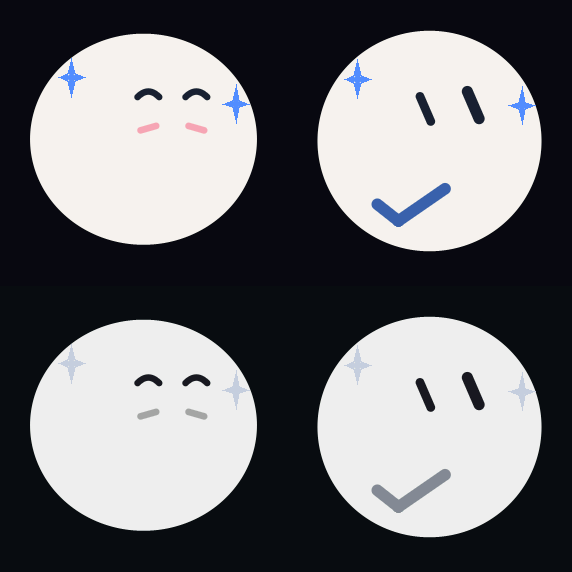
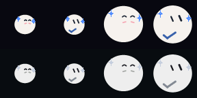

# Happy and Done visual semantics

2026-09-16 redesign and native host acceptance for the shared `BotUx`
component. This replaces the three small orbiting circles that previously
carried most of the celebratory meaning in both states.

## State mapping and meaning

The Chinese natural descriptions map directly to the existing append-only
moods: `很高兴` is `Mood::Happy` (value 4), and `已经完成` is `Mood::Done`
(value 11). No mood, expression or animation value was added or reordered.
The public combination count remains 14 moods × 10 expressions × 8 animations
= 1,120.

Happy uses rounded smile-arc eyes, two warm cheek strokes, a buoyant Bounce
rhythm and two large tapered sparkles. The cheek strokes follow the same eased
eye-group centre used by gaze, IMU countershift and explicit directions, so
they remain attached to the face instead of drifting when it turns.

Done uses a thick rounded check in the lower portion of the ordinary Bot body.
The check is a persistent mood mark and remains present with every explicit
expression and animation. Its Auto animation adds two restrained tapered
sparkles near the upper silhouette. The check is below the maximum eye extent,
including every explicit expression and the complete nine-direction gaze
field. Its color mixes the theme accent 62 percent with the eye color 38
percent. This preserves the theme hue while protecting contrast in the Watch
Mono theme and at the 40 px toolbar size; the sparkles keep the unmodified
accent color.

## Motion and composition

Happy Auto selects Bounce; Done Auto selects Sparkle. Explicit Animation values
continue to replace the Auto choreography, while the Happy cheeks and Done
check retain mood identity. Explicit Expression values remain independently
selectable for both persistent moods. `poke()` still owns its transient
Alarmed → Joy faces before returning to the caller-selected expression.

Sparkle now draws two four-point forms built from four tapered native triangles
and one rounded centre. They replace the former three tiny circles. The stars
stay near the upper-left and upper-right silhouette, use alternating scale and
a slight angular drift, and never orbit across the face or Done check. At zero
motion they freeze visibly; reduced motion retains the marks with 20 percent of
the normal travel. The Happy cheeks and Done check also remain visible when
motion is reduced or zero.

All device-frame geometry uses existing M5GFX primitives and fixed scalar
locals. Drawing adds no heap allocation, framebuffer or retained particle
state. The host M5GFX stand-in rasterizes `fillTriangle` into its existing
RGB565 canvas so the catalog and pixel tests observe the same star geometry
instead of an SVG-only approximation.

## Native host evidence

The 286 px sheet uses the Watch level-two motion profile (`speed=0.73`,
`amount=0.55`). Columns are Happy and Done; rows are the Watch Night and Mono
themes. It is a native RGB565 host capture. The Mono check remains visibly
distinct from the body without introducing a theme-specific color.

Each row shows 40 px Happy/Done followed by 72 px Happy/Done. The upper row is
Night and the lower row is Mono. The 40 px renders are centred in 72 px cells
without scaling, so the image preserves their actual pixel geometry.

The bilingual catalog regenerates only the three changed 120 px animations:
`Mood-4.gif`, `Mood-11.gif` and `Animation-7.gif`. Each contains 72 native
frames sampled at 100 ms. `wiki/bot-ux/intro.md` and the self-contained
`intro.html` describe the revised meaning and keep the 1,120-combination
contract current.

## Validation

The focused host harness compiles the real component as C++11 with
`-Wall -Wextra -Werror`. It keeps the existing full combination, gaze,
mirroring, coverage, transition, sleep and sparse-frame checks, and adds:

- Happy/Done separation at 40, 72, 120 and 286 px in Night and Mono;
- exactly two tapered star components, with minimum scale, vertical bias and
  non-circular occupancy checks;
- a connected Done check spanning the expected lower-body region;
- a minimum RGB565 luminance separation between the check and both Watch theme
  bodies;
- preserved marks under full, reduced and zero motion;
- all nine explicit expressions combined with all nine explicit gaze
  directions at 40, 72 and 286 px, with eye-to-cheek/check separation;
- transient poke face precedence and restoration of an explicit expression;
- exact bilingual `很高兴` and `已经完成` description mappings.

The captures and tests establish renderer geometry and RGB565 contrast. They do
not claim panel optics, device frame time, physical controls, Bluetooth or
serial acceptance.

The final focused host run passed with the real `BotUx.cpp`, including all
1,120 combinations and the prior gaze/orb/sleep regressions. The integrated
Core2 PlatformIO build also passed, using 60,752 B RAM and 1,517,245 B flash.

## Firmware evidence boundary

The final Core2 `firmware.bin` is 1,523,824 bytes with SHA-256
`b4a6ffbda75c85ebaff00ebd2a7cfc4ef04fadb77120db3610e9828c7c134ccf`.
The USB inventory contained only the identified StopWatch at
`/dev/cu.usbmodem214201`; the previously verified Core2 serial bridge at
`/dev/cu.usbserial-5C9A0591461` was absent. No Core2 `chip_id`, upload or serial
boot probe was attempted, which avoids writing the ESP32 firmware to the
ESP32-S3 watch. StopWatch deployment and on-panel acceptance belong to the
Watch integration validation rather than this shared renderer record.
